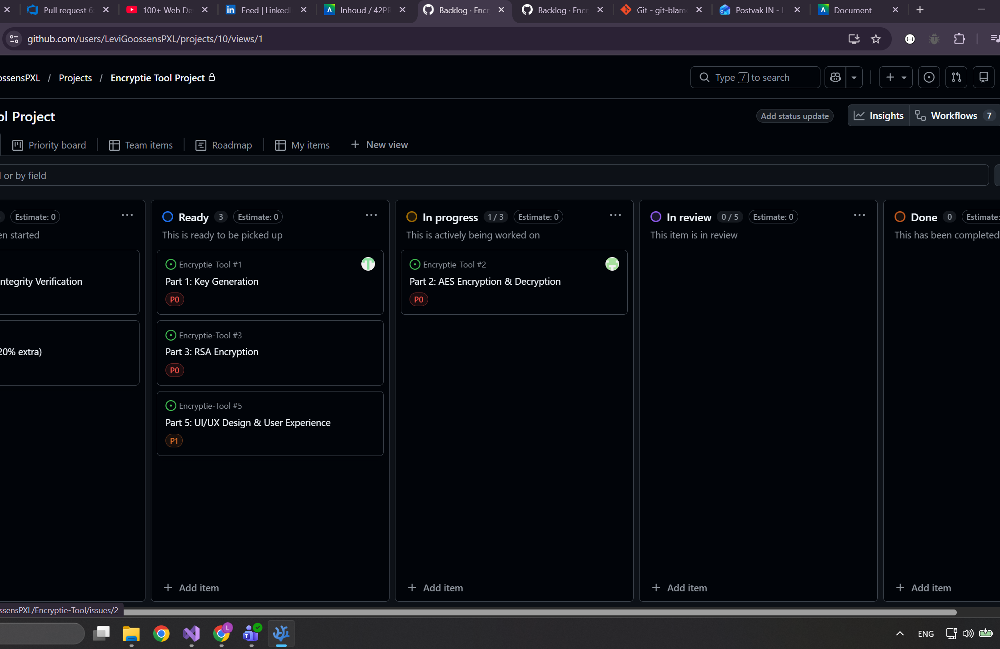
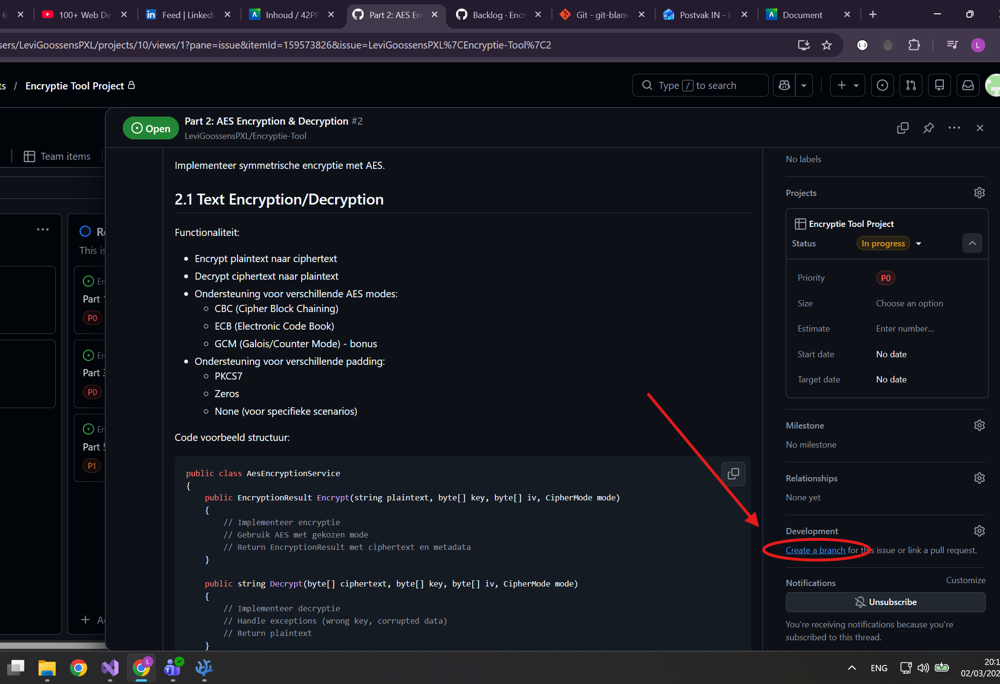
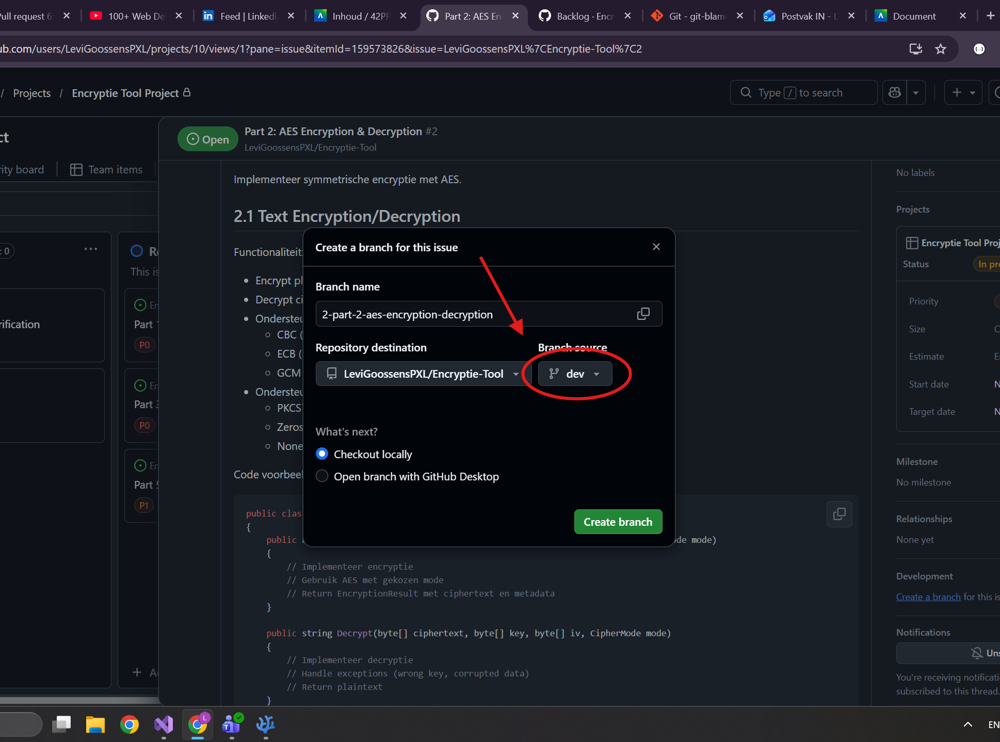
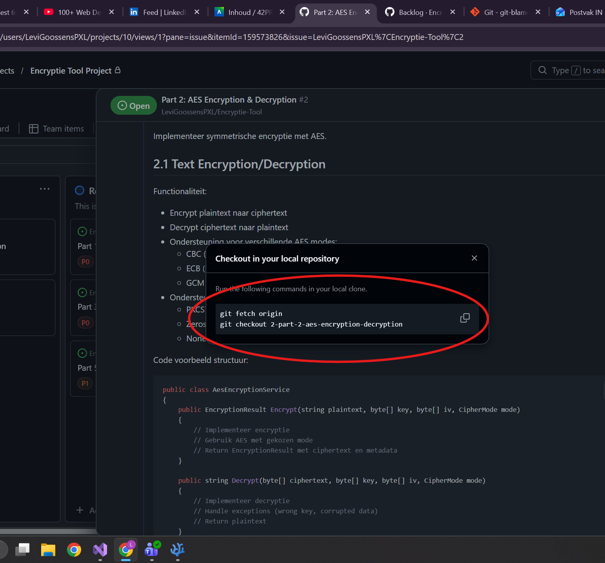
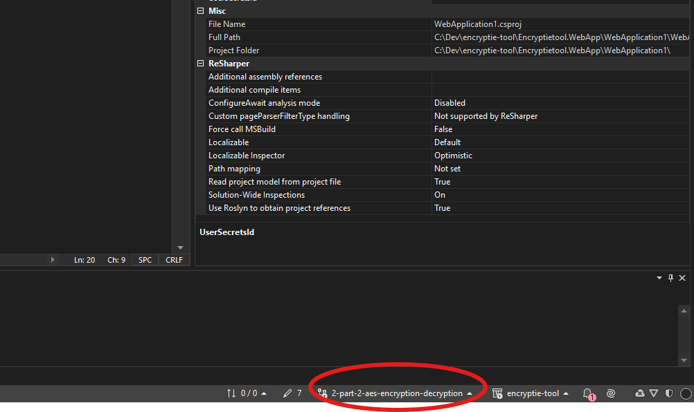

# Encryptie tool

## folder structure (proposed)
```
.
└── Encryptie-tool.WebApp/
    └── WebApplication1/
        ├── Entities (database entities)
        ├── Models (view models)
        ├── Repositories (repository classes)/
        │   └── Interfaces (repository interfaces)
        ├── Services (service classes)/
        │   └── Interfaces (service interfaces)
        └── Views (webpages)
```

## Strategy (proposed)
1. select the issue

2. make a branch

3. select "dev" as a source

4. switch to branch in visual studio or execute the given commands in the terminal (powershell) of visual studio.


5. write code ...

6. make pull request on github to "dev" branch

7. get it reviewed by one other person

8. reviewer approves it

9. someone merges it to "dev" branch